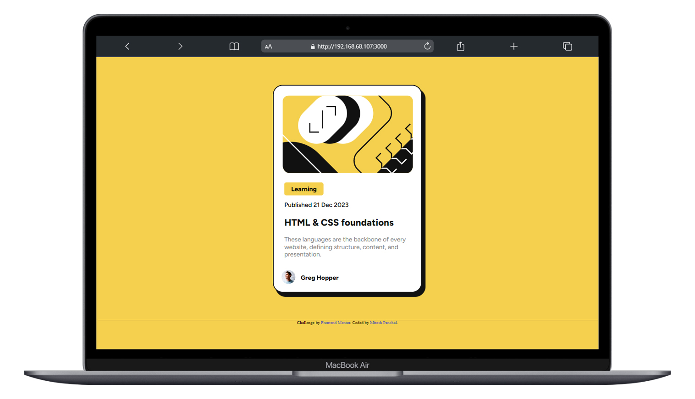
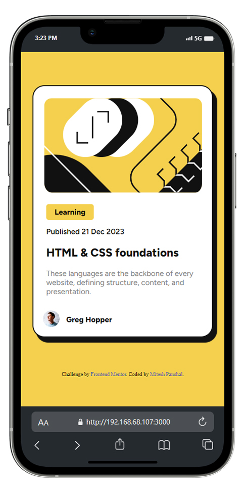
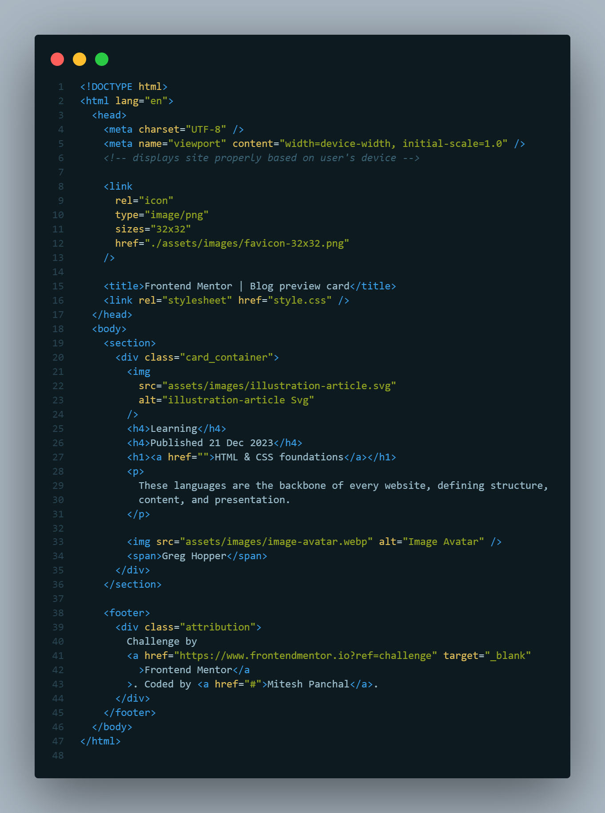
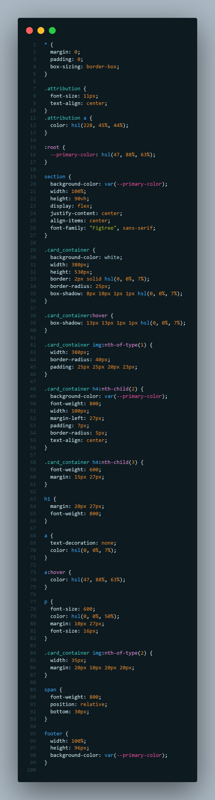

# Frontend Mentor - Blog preview card solution

This is a solution to the [Blog preview card challenge on Frontend Mentor](https://www.frontendmentor.io/challenges/blog-preview-card-ckPaj01IcS). Frontend Mentor challenges help you improve your coding skills by building realistic projects. 

## Table of contents

- [Overview](#overview)
  - [The challenge](#the-challenge)
  - [Screenshot](#screenshot)
  - [Links](#links)
- [My process](#my-process)
  - [Built with](#built-with)
  - [Useful resources](#useful-resources)
- [Author](#author)
- [Acknowledgments](#acknowledgments)

## Overview

### The challenge

Users should be able to:

- See hover and focus states for all interactive elements on the page

### Screenshot

### Links

- Solution URL: [solution URL](https://github.com/miteshp98/blog-preview-card-main)
- Live Site URL: [live site URL](https://miteshp98.github.io/blog-preview-card-main/)

## My process

### Built with

- Semantic HTML5 markup
- CSS custom properties
- Flexbox
- CSS Variable For Primary Color

### Useful resources

- [Udemy - Course 1](https://www.udemy.com/share/101W9C3@QJfMAYeWW-ZciTEqJuAPKNnI9p3Zv1cfWCX5KXp-i_-u7sMyfa9_jAe-TSdh0IRMwA==/) - This Course Helped me to Learn Web Devlopment.

## Author

- Linkedin - [Mitesh Panchal](https://www.linkedin.com/in/mitesh-panchal-356558126/)
- Frontend Mentor - [@miteshp98](https://www.frontendmentor.io/profile/miteshp98)

## Acknowledgments

### Frontend Mentor
- Special thanks to Frontend Mentor for providing this challenge and helping me improve my frontend skills.

**Note: Delete this note and edit this section's content as necessary. If you completed this challenge by yourself, feel free to delete this section entirely.**

## Contact

Feel free to connect with me on [LinkedIn](https://www.linkedin.com/in/mitesh-panchal-356558126/)  for feedback or collaboration.
